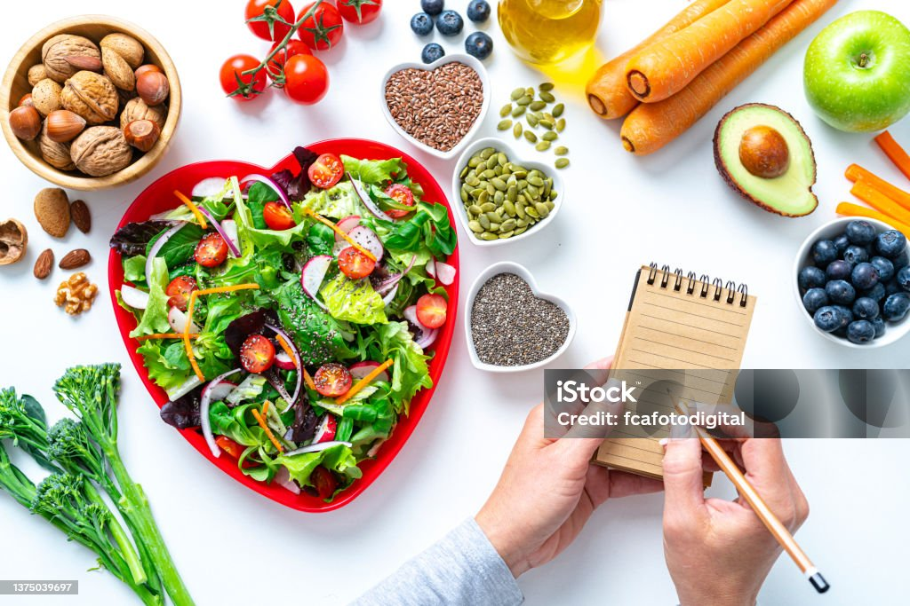
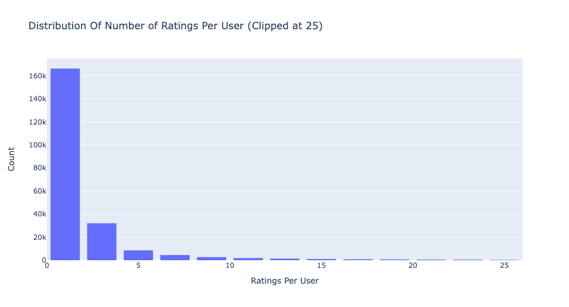
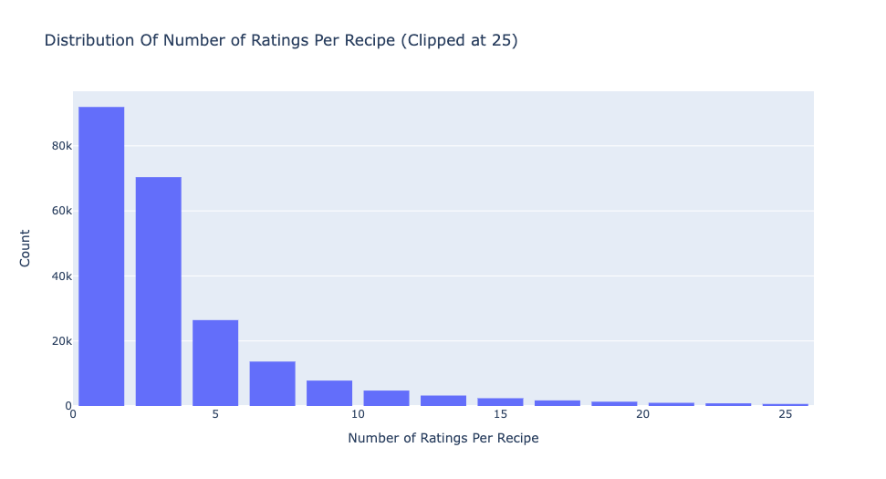
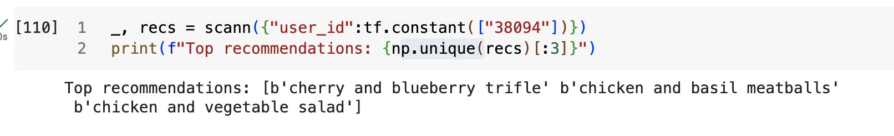

# Recipe Recommendation System with Dietary Restriction Embeddings

##### Project by Nicole Michaud, 02/26/2024

<a href="https://github.com/nicolemichaud03/Recipe-Recommender-System/blob/main/NNnotebook.ipynb">Final Notebook</a>

<a href="https://github.com/nicolemichaud03/Recipe-Recommender-System/blob/main/PDFs/presentation.pdf">Presentation</a>

## Introduction
It can be hard to continuously come up with new and interesting recipes to cook, especially if you have certain dietary restrictions. Many people use websites such as food.com to find, try, and rate recipes. From user and recipe data from Food.com, can we provide users with recommendations for the next recipes that users should try, taking into account their dietary specifications?
Taking into account user preferences, shown by recipes they have rated highly in the past, as well as their certain dietary restriction categories of recipes, we create a model that is able to provide the top 3 recommendations for next recipes to try that the user is most likely to rate highly.

## Business Understanding
The proposed recipe recommendation system would be useful, because it can be time consuming and repetitive for people to come up with new recipes to make all the time, especially when their options are narrowed down due to dietary restrictions. If a recommender system took into account not only a user's preferences, based on past recipes that the user has rated highly, but also the type of diet category that the user is most likely to enjoy a recipe from, then this can simplify this task for the user and in turn, make them favor our service more for finding recipes in the future.

While recommendations based solely off of past user ratings can be good recommendations, adding in more information (in this case, diet-types of recipes) can make the recommendations more personalized. With a neural network, extra user or item features can be incorporated into a recommendation system model easily, in the form of embeddings. 

See this <a href="https://towardsdatascience.com/modern-recommendation-systems-with-neural-networks-3cc06a6ded2c">blog post</a> to learn more about the different types of recommendation systems you can build with neural networks. 

## Data Understanding

The <a href="">user and recipe data</a> is from Food.com, collected from the years 2000 to 2018.

The data contains 226,570 unique users who have rated between 1 and 7,671 recipes:

And it contains 231,637 different recipes that have been rated by between 1 and 1,613 users:

Recipes were rated by users on a scale of 1 to 5 stars.

## Data Preparation

In the miscellaneous notebook associated with this project, the different features of the recipe data were compared to see which ones would contain the most information about each of the three diet types that will be taken into account (vegetarian, vegan, and gluten-free). It was determined that the 'tags' feature contained the most information about diets that were gluten-free, while a different approach, ingredient filtering, would be necessary for recipes of the vegan and vegetarian diet-types.

A text cleaning function removed punctuation, numbers, and symbols from the relevant text data columns, and made all letters lowercase. Using food category information mainly sourced from the <a href="https://www.ars.usda.gov/ARSUserFiles/80400530/pdf/1720/Food_Category_List_2017-March%202020.pdf">USDA</a>, I compiled an extensive list of the ingredient words that would be used in recipes containing meat, seafood, and other animal products. Recipe's that did not contain any of the animal product ingredients were labeled vegan, and recipes that did not contain specifically meat or seafood were labeled vegetarian. Recipes can be all or none of these diet types. A new column was created that combined the designations for each of these diet types for each recipe to be used as a single embedding in the nerual network model.

## Modeling and Evaluation

This is essentially a regression task, achieved by Collaborative Filtering. We are trying to predict a user's rating of recipes they have not yet tried, and we are doing so by comparing the user to other similar users and the recipes that they've rated highly (user-user similarity). Then, we want to rank these retrieved item ratings to provide the user with the top "n" recommendations they are most likely to rate highly. For this purpose, we need to use a multi-task neural network model that achieves both the retrieval and ranking tasks.

Using  <a href="https://www.tensorflow.org/recommenders/examples/multitask">TensorFlow Recommenders </a>, I created an initial (baseline) model that contained only the embeddings for the user IDs and recipe IDs and made recommendations only based on previous rating data from users, and that completed both retrieval and ranking tasks for recommendations. By compiling models with different weights assigned to both the retrieval and ranking task, it was determined that the joint model (both retrieval and ranking tasks given weight) performed the best overall.

The joint model performed better than the ranking-only and the retrieval-only models with a Top-100 Retrieval Accuracy of about 0.001 and an RMSE of about 2.196.

In the next model, I added in an embedding for the diet-type feature that I created.

This model had a top-100 retrieval accuracy of about 0.0023 and an RMSE of about 1.676. 

This was the best performing model in terms of the lowest RMSE value. The top-100 accuracy value is lower than the previous joint model, but considering the sparsity of the data, this is understandable. Perhaps this value could be improved further with other features or tuning.

I then used ScaNN (Scalable Nearest Neighbors) in an attempt to optimize the speed and performance of the retrieval task. Compared to brute force serving, ScaNN was more efficient.

##### An example user with recommendations:

Top Recommendations for User #38094:
- ‘Cherry and blueberry trifle’
- ‘Chicken and basil meatballs’
- ‘Chicken and vegetable salad’

## Conclusion

### Next Steps:
Next Steps:
- Deploy model with diet-type embeddings
- Update model with new data
- Add more diet types 
- Try to improve model metrics:
    - experiment with different depths
    - try using a feature cross
    - further tune model parameters
    
### Limitations:
 - Model takes a long time to run and is computationally expensive
 - Metrics would likely improve with more epochs, but this was not able to be explored due to long runtime
 - Diet type classifications of recipes are not 100% reliable

## Contact Me:
- LinkedIn: https://www.linkedin.com/in/nicole-michaud2/
- Email: michaud.nicole00@gmail.com
- Blog: https://medium.com/@nicolemichaud03

